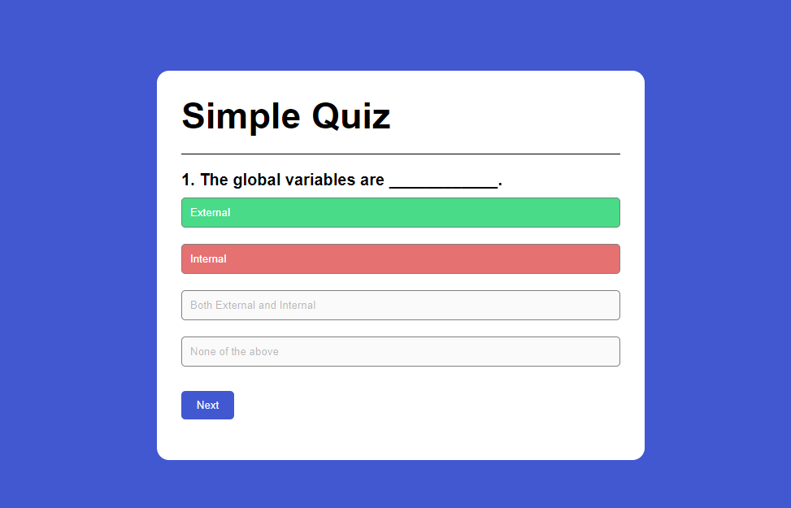

# Simple Quiz App

## Overview

The **Simple Quiz App** is a basic web application that allows users to take quizzes on various topics. It is built using HTML, CSS, and JavaScript.

## Features

- Multiple choice questions
- Immediate feedback on answers
- Score tracking
- Different categories and difficulty levels

## Demo

[Simple Quiz App](Screenshot.png)

## Screenshots




## Installation

To run this project locally, follow these steps:

1. Clone the repository:
   ```bash
   git clone https://github.com/arshthakur/Todo-List.git
   ```
2. Navigate to the project directory:
   ```bash
   cd ToDoList
   ```
3. Open `index.html` in your web browser.

## Usage

1. Open the application in your browser.
2. Select a quiz category and difficulty level.
3. Answer the multiple-choice questions.
4. View your score at the end of the quiz.

## Technologies Used

- HTML
- CSS
- JavaScript

## Contributing

Contributions are welcome! To contribute to this project, follow these steps:

1. Fork the repository.
2. Create a new branch:
   ```bash
   git checkout -b feature-branch
   ```
3. Make your changes.
4. Commit your changes:
   ```bash
   git commit -m 'Add some feature'
   ```
5. Push to the branch:
   ```bash
   git push origin feature-branch
   ```
6. Open a pull request.

## License

This project is licensed under the MIT License. See the [LICENSE](LICENSE) file for more details.

## Contact

If you have any questions or suggestions, feel free to contact me at [harshthakur0047@gmail.com].
